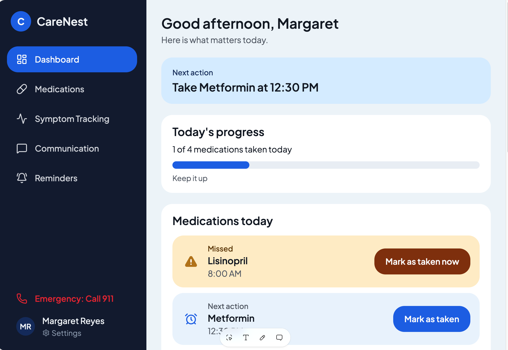
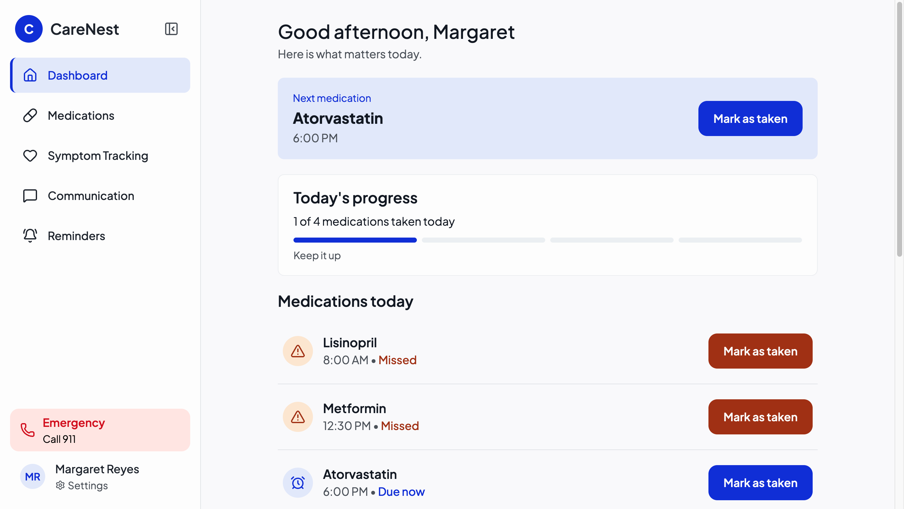
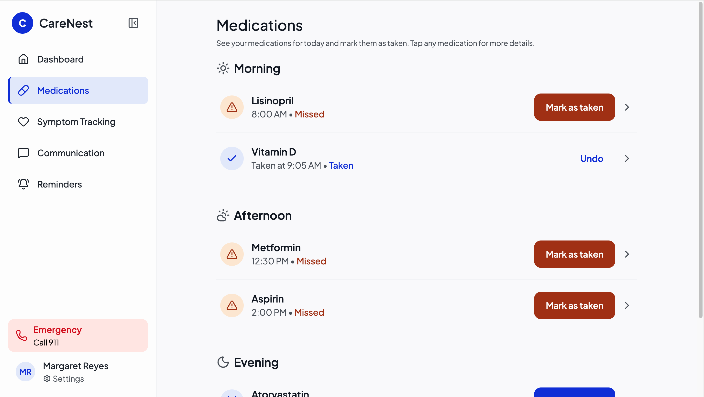
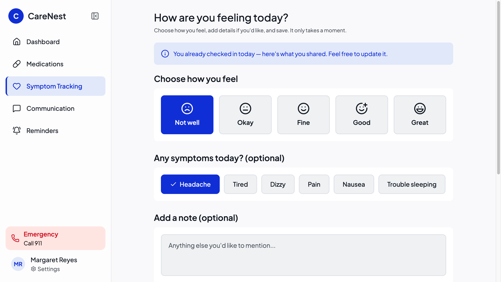
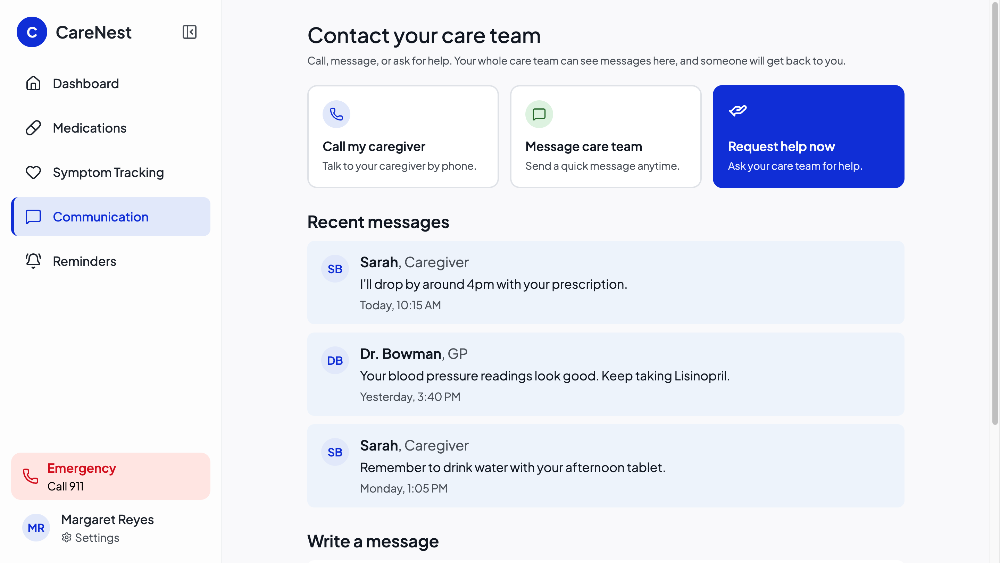
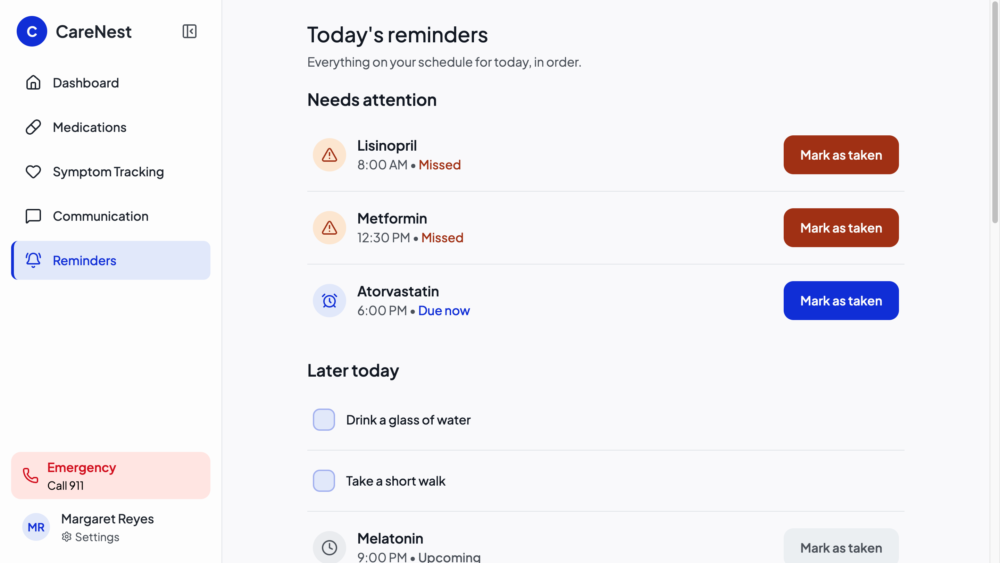

# CareNest. Короткий огляд рішення
Цей документ показує, як виглядає готовий застосунок і як користувач проходить основні сценарії. Детальні пояснення рішень та процесу роботи знаходяться у файлі `README.md`.
Живий прототип: https://caring-heart-companion.lovable.app/ ---
## Дашборд
Це перший екран, який бачить пацієнт. Зверху одразу видно найближчу дію на сьогодні, наприклад, прийняти конкретний препарат. Нижче, прогрес дня простими словами, скільки ліків уже прийнято. Далі йде повний список сьогоднішніх ліків, кожен рядок показує стан: очікується, час прийому настав, пропущено або вже прийнято. Внизу, щоденні задачі та дві плитки швидкого доступу до самопочуття й повідомлень.
**До і після.** Перша версія мала кольорові картки під кожен стан ліків і темний сайдбар. Після чесного відгуку, що інтерфейс виглядає перевантажено кольором і незрозуміло, що саме клікабельне, я переробила дизайн: пласкі рядки замість кольорових карток, світлий сайдбар, який можна згорнути, і кольір лишився тільки там, де він дійсно щось сигналізує.
| Стара версія | Нова версія |
|---|---|
|  |  |
## Ліки 
Тут пацієнт бачить повний перелік препаратів, згрупований за часом доби: ранок, день, вечір. Натискання на будь-який препарат відкриває вікно з деталями, дозуванням, розкладом прийому та поясненням простою мовою, для чого цей препарат. Позначення "прийнято" завжди можна скасувати натисканням на відповідний напис, без обмеження в часі.
## Самопочуття 
Швидкий щоденний запис стану, займає лише кілька секунд. Пацієнт обирає одну з п'яти позначок настрою, за бажанням додає симптоми чи коротку нотатку. Якщо запис на сьогодні вже існує, форма показує його заново з можливістю відредагувати, а не пропонує заповнити все з нуля.
## Комунікація 
Пацієнт може зателефонувати доглядачу, написати команді догляду або надіслати запит на допомогу. Усі повідомлення потрапляють у спільну стрічку, яку бачать і доглядач, і лікар. Для швидкої відповіді є готові короткі фрази, які надсилаються одним натисканням.
## Нагадування 
Об'єднаний список усіх подій дня, ліки та задачі разом, відсортований за важливістю: спочатку те, що потребує уваги, потім заплановане на пізніше, і насамкінець уже виконане. Внизу, короткий перегляд завтрашнього розкладу.
---
## Наскрізний сценарій
Щоб показати, як екрани працюють разом, а не окремо одне від одного:
1. Пацієнт відкриває застосунок і одразу на Дашборді бачить, що пропустив ранкові ліки. 2. Переходить у розділ Ліки, знаходить потрібний препарат у списку.
3. Натискає кнопку прийняття, зверху екрана з'являється коротке підтвердження.
4. Повертається на Дашборд, і пропущений препарат уже позначено як прийнятий.
5. Якщо щось непокоїть, пацієнт одним дотиком надсилає повідомлення команді догляду через розділ Комунікація.
